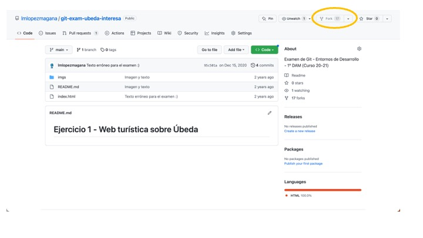
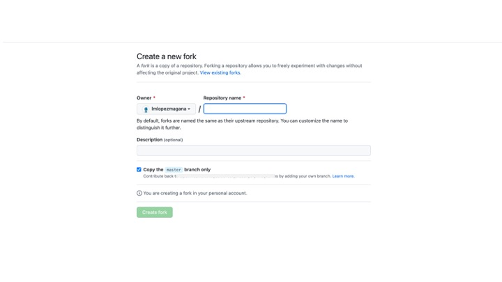

# Ejercicio 1 - Web turística sobre Úbeda

Para realizar un fork de este repositorio debes pulsar sobre el botón **Fork** que hay en la parte superior derecha de la pantalla.

Rellena los datos del nuevo repositorio y completa la operación. Ahora tendrás un nuevo repositorio en tu usuario que será una copia del original.

